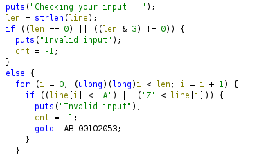
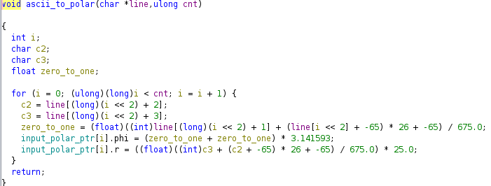
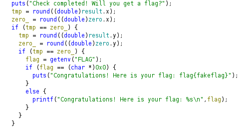
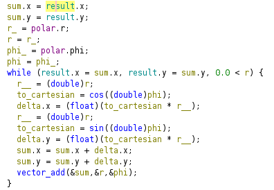
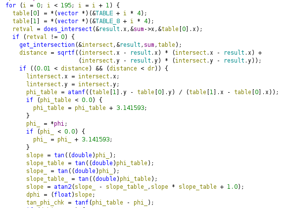
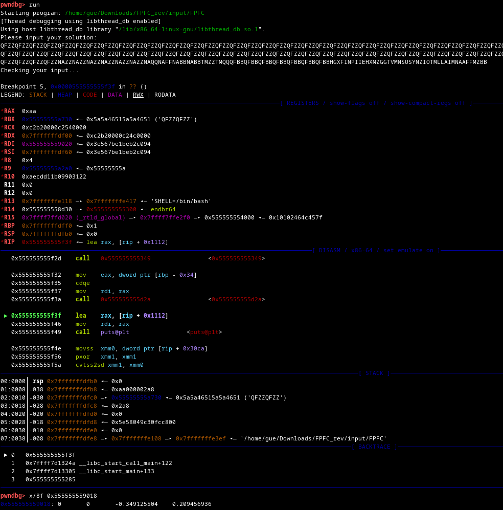
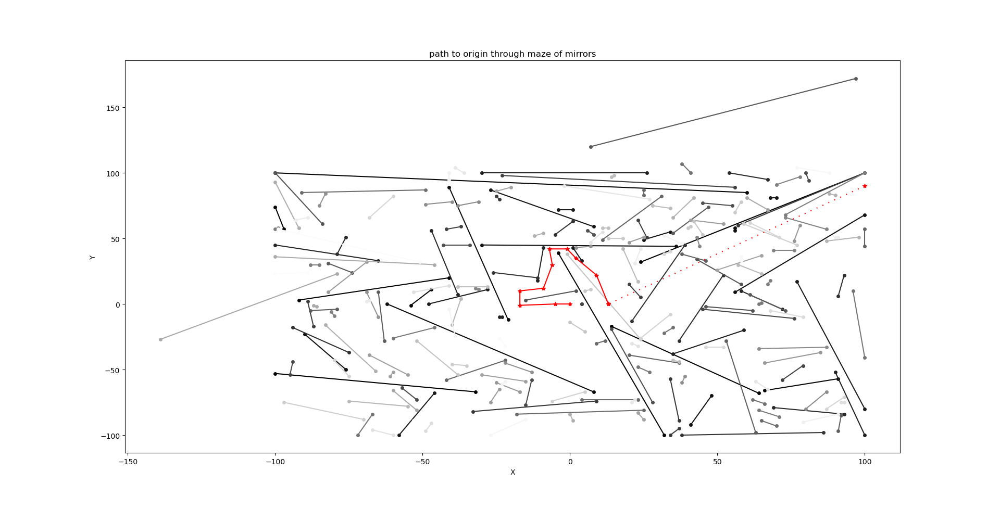

# FPFC

```
Behold the newest technology! Our floating point flag checker will surely block all hackers from discovering our flags!

nc fpfc.challs.open.ecsc2024.it 38015
```

We got a x64 Linux position independent, stripped binary (without debug symbols):

```
Please input your solution: 
test 
Checking your input...
Invalid input
```

I started analyzing the binary with ghidra, renaming functions, changing
function signatures and creating structs for vectors. Most of the code was floating point instructions and a lot of trigonometry. The floating point stuff and alot of conversions between float and double was making the binary hard to reverse engineer.

Determining the input syntax it must be A-Z and a multiple of 4:



```
Please input your solution: 
ABYZ
Checking your input...
Check completed! Will you get a flag?
```

Determining the input semantic we see its a vector in polar coordinates.
The first 2 chars are the angle between 0 and 2*pi.
The latter 2 chars are the distance between 0 and 25.
Both of which are base-26 encoded in ASCII.

Example:

* AB is an angle of 0.009 rad $((0*26+1)/675*2*\pi)$.
* YZ is a distance of 24 $((24*26+25)/675*25)$



Next thing I found was the win condition. Reaching the origin provided the flag. Of course the flag was redacted from the binary. You only get it when playing on the public server:



The main logic of the program was these two code sections. Please note the the code is only as readable because of alot of manual reverse engineering work (namely symbol renaming and struct creation) - the binary was stripped completely from all symbolic information:

This code does convert polar coordinates to cartesian:



And this code is part of the vector_add function called from the code above. This function caclulates intersection point between two line segments.




Seeing this code I thought the intersection between the line segment
and the input vector just determines the next starting point.

The following input was crafted manually by going into the direction of the origin and calculating the vectors with a calculator. At that time I thought I will reach origin evntually by just going into the right direction.

I used gdb to make sure my assumptions where right.
The breakpoint was set to an address where the current position was updated. The 'x' command displays the memory address of the global variable that holds this position. 0x555555559018 is the address of the global variable:


But obviously my assumptions where wrong. I could never reach origin using my manually crafted vectors. It feeled like I could not
cross some invisible border. The following point was as close I could get to this invisible border:

QFZZQFZZQFZZQFZZQFZZQFZZQFZZQFZZQFZZQFZZQFZZQFZZQFZZQFZZQFZZQFZZQFZZQFZZQFZZQFZZQFZZQFZZQFZZQFZZQFZZQFZZQFZZQFZZQFZZQFZZQFZZQFZZQFZZQFZZQFZZQFZZQFZZQFZZQFZZQFZZQFZZQFZZQFZZQFZZQFZZQFZZQFZZQFZZQFZZQFZZQFZZQFZZQFZZQFZZQFZZQFZZQFZZQFZZQFZZQFZZQFZZQFZZQFZZQFZZQFZZQFZZQFZZQFZZQFZZQFZZQFZZQFZZQFZZQFZZQFZZQFZZQFZZQFZZQFZZQFZZQFZZQFZZQFZZQFZZQFZZQFZZQFZZQFZZQFZZQFZZQFZZQFZZQFZZQFZZQFZZQFZZQFZZQFZZQFZZQFZZQFZZQFZZQFZZQFZZQFZZQFZZQFZZQFZZQFZZQFZZQFZZQFZZQFZZQFZZQFZZQFZZQFZZQFZZQFZZQFZZQFZZQFZZQFZZQFZZQFZZQFZZQFZZQFZZQFZZQFZZQFZZQFZZQFZZQFZZQFZZQFZZQFZZQFZZQFZZQFZZNAZZNAZZNAZZNAZZNAZZNAZZNAQQNAFFNABBNABBTMZZTMQQQFBBQFBBQFBBQFBBQFBBQFBBQFBB
0x555555559018:	0	0	13.6110926	0.179063424

Thus I decided it was time to visualize the line segments I found in memory! After dumping them with ghidra into a text file I wrote a python program which displayed the data. 

This was the breakthrough. Visualizeing the lines and using gdb with crafted input data and visualizing the newly calculated points I saw that the line segments where reflecting my vector. So the lines where mirrors! And the pane was a labyrinth!



The gray scale corresponds to the order the code uses to traverse the mirrors. Darker mirrors are handled first. The red line is my way through the maze.

Knowing that I wrote a tool to guide me through the maze!
It gets previous point and the desired next point (x1, y1, x2, y2) and calculates the polar vector (converted to ASCII to provide valid input for the program) to reach x2, y2 from x1, y1.


```console
$ python3 tool.py 13 0 9 22
r: 22 phi: 1.75 -> HGXF
$ python3 tool.py 9 22 2 35
r: 15 phi: 2.06 -> INPI
$ python3 tool.py 2 35 -1 42
r: 8 phi: 1.98 -> IEHX
$ python3 tool.py -1 42 -7 42
r: 6 phi: 3.14 -> MZGG
$ python3 tool.py -7 42 -6 30
r: 12 phi: 4.80 -> TVMN
$ python3 tool.py -6 30 -9 12
r: 18 phi: 4.55 -> SUSY
$ python3 tool.py -9 12 -17 10
r: 8 phi: 3.39 -> NZIO
$ python3 tool.py -17 10 -17 -1
r: 11 phi: 4.71 -> TMLL
$ python3 tool.py -17 -1 -5 0
r: 12 phi: 0.08 -> AIMN
$ python3 tool.py -5 0 0 0
r: 5 phi: 0.00 -> AAFF
$ python3 tool.py 1 0 0 0
r: 1 phi: 3.14 -> MZBB
```

Thats it now I reached the origin. After submitting my input vectors to the server I got my flag on the first try:

```console
$ nc fpfc.challs.open.ecsc2024.it 38015
Please input your solution: 
QFZZQFZZQFZZQFZZQFZZQFZZQFZZQFZZQFZZQFZZQFZZQFZZQFZZQFZZQFZZQFZZQFZZQFZZQFZZQFZZQFZZQFZZQFZZQFZZQFZZQFZZQFZZQFZZQFZZQFZZQFZZQFZZQFZZQFZZQFZZQFZZQFZZQFZZQFZZQFZZQFZZQFZZQFZZQFZZQFZZQFZZQFZZQFZZQFZZQFZZQFZZQFZZQFZZQFZZQFZZQFZZQFZZQFZZQFZZQFZZQFZZQFZZQFZZQFZZQFZZQFZZQFZZQFZZQFZZQFZZQFZZQFZZQFZZQFZZQFZZQFZZQFZZQFZZQFZZQFZZQFZZQFZZQFZZQFZZQFZZQFZZQFZZQFZZQFZZQFZZQFZZQFZZQFZZQFZZQFZZQFZZQFZZQFZZQFZZQFZZQFZZQFZZQFZZQFZZQFZZQFZZQFZZQFZZQFZZQFZZQFZZQFZZQFZZQFZZQFZZQFZZQFZZQFZZQFZZQFZZQFZZQFZZQFZZQFZZQFZZQFZZQFZZQFZZQFZZQFZZQFZZQFZZQFZZQFZZQFZZQFZZQFZZQFZZQFZZQFZZNAZZNAZZNAZZNAZZNAZZNAZZNAQQNAFFNABBNABBTMZZTMQQQFBBQFBBQFBBQFBBQFBBQFBBQFBBHGXFINPIIEHXMZGGTVMNSUSYNZIOTMLLAIMNAAFFMZBB
Checking your input...
Check completed! Will you get a flag?
Congratulations! Here is your flag: openECSC{4lm0s7_l1k3_p1ng_pwng_0n_th3_w4llz_c1452fd3}
```

Now, knowing all the details this is of course not the smallest possible input data to get the flag. It is an open question for the reader to find the smallest input which satisfies the win condition :-).

