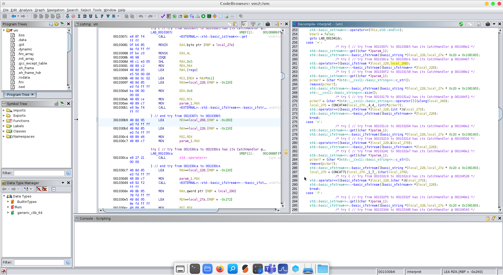
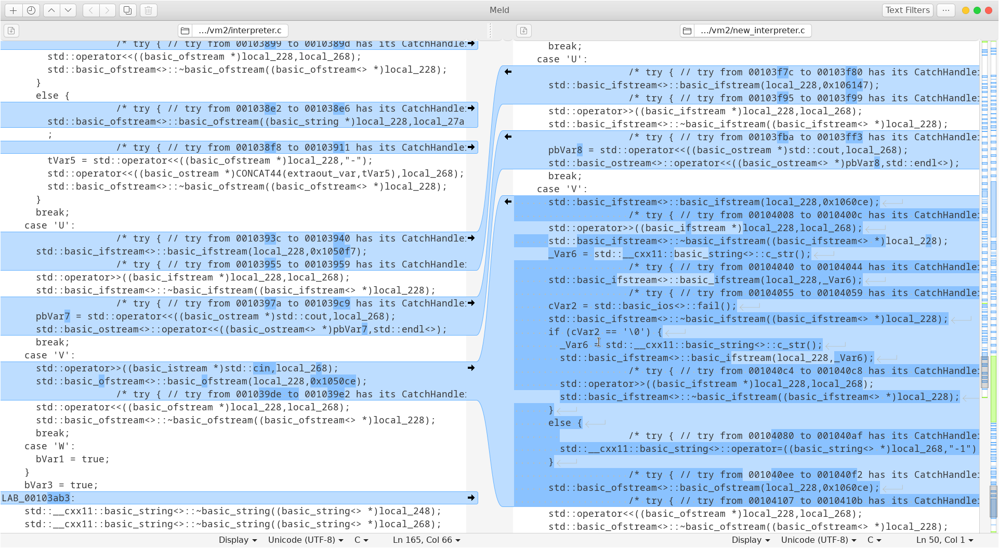
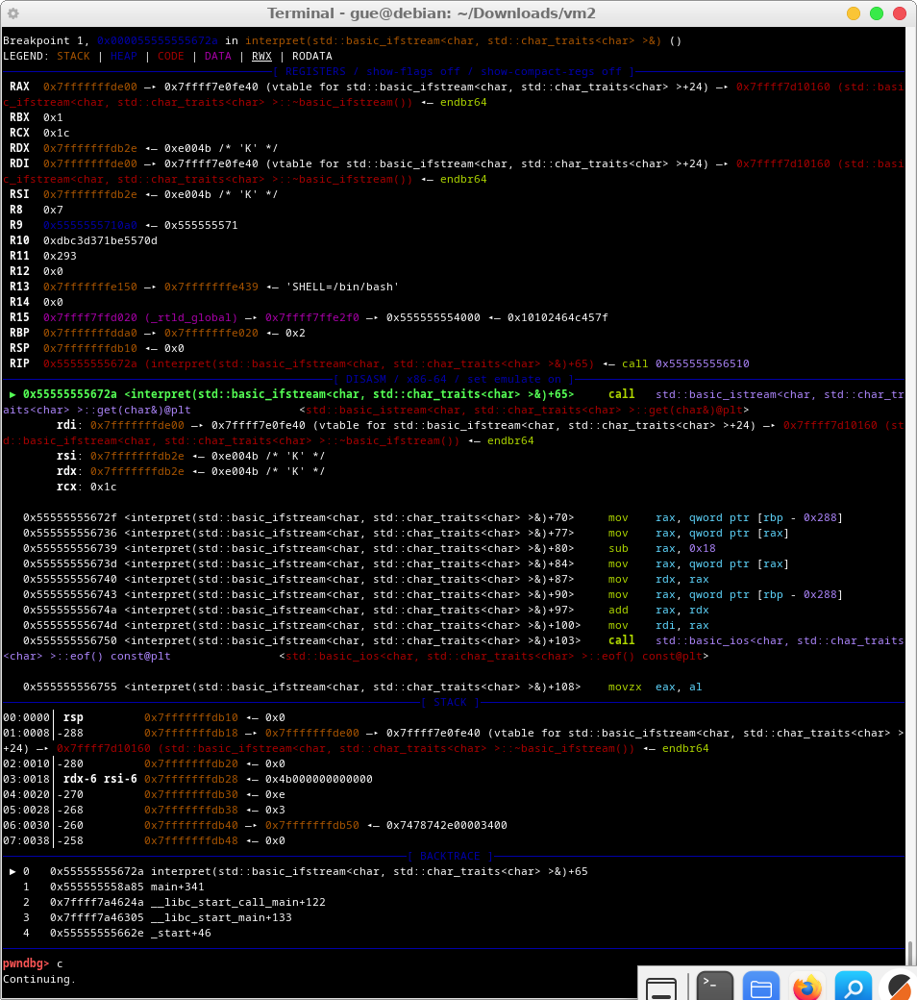

# fsvm 2

## Description
```
I wrote an improved version of my previous VM, but it's still not capable of
printing good descriptions.
```

## Provided Files
```
bytecode - the bytecode which shoud be reversed
vm - the virtual machine (ELF 64-bit, x86-64, not stripped)
```

## Writeup

I did this writeup because I enjoyed solving the fsvm virtual machine
challenges. fsvm stands for filesystem virtual machine. The registers the vm
uses are files in the regs directory.

After having solved fsvm the day before I was eager to continue with the second
version of the virtual machine. I thought it would be an easy solve reusing the
emulator I have written for the first version of the virtual machine. This
turned out to be wrong. You will see why soon.

This is how the hexdump of the bytecode looks like:

```console
$ xxd bytecode | head
00000000: 4041 5200 5200 5201 5401 5100 0100 5200  @AR.R.R.T.Q...R.
00000010: 5401 5100 0100 4151 0001 013e 0000 5301  T.Q...AQ...>..S.
00000020: 5301 5201 4252 0251 0102 0142 5101 0202  S.R.BR.Q...BQ...
00000030: 5101 0201 5101 0201 4251 0102 0252 0153  Q...Q...BQ...R.S
00000040: 0251 0102 013e 0101 3f00 0100 4142 5202  .Q...>..?...ABR.
00000050: 5402 5201 5201 5102 0101 5201 4343 5101  T.R.R.Q...R.CCQ.
00000060: 0303 5102 0202 5102 0202 5102 0101 3e01  ..Q...Q...Q...>.
00000070: 013f 0001 0042 5202 5102 0303 5102 0303  .?...BR.Q...Q...
00000080: 3e03 013f 0001 0054 0241 5103 0101 5103  >..?...T.AQ...Q.
00000090: 0101 5103 0101 5102 0101 5102 0101 5102  ..Q...Q...Q...Q.
```

The bytecode reads like this: The readable ASCII characters are the
instructions. And the unprintable *.* characters are the arguments. Each
argument being a register number. The following notes I have taken during
solving the first part of the challenge help reading the code:

```
, reg0 = ""      @ reg0 = "0" 
- reg1 = ""      A reg1 = "0"
. reg2 = ""      B reg2 = "0"
/ reg3 = ""      C reg3 = "0"
0 reg4 = ""      D reg4 = "0"
1 reg5 = ""      E reg5 = "0"
2 reg6 = ""      F reg6 = "0"
3 reg7 = ""      G reg7 = "0"

Q... reg<3> = add(reg<1>, reg<2>)
R.   reg<1> = concat(reg<1>, "1")
S.   reg<1> = remove_last_char(reg<1>)
T.   reg<1> = negate(reg<1>)
U    cout(reg4)
V    reg0 = cin()
W    exit()
?... reg<3> = concat(reg<1>, reg<2>)
>..  reg<2> = dec_to_ascii(reg<1>)
=..  reg<2> = ascii_to_dec(get_last_char(reg<1>))
(    seek(reg5)
)    seek(reg5) if reg6 == reg7
*    seek(reg5) if reg6 != reg7
+    seek(reg5) if reg6 < reg7
```

Most of it was reversed using ghidra on the interpret() function:


My plan was to start the vm and use strace to check filesystem access, but see
what happened:

```console
$ ./vm
Usage: ./vm <bytecode>

$ ./vm bytecode 
File_not_found
```

Lets check the *File\_not\_found* error with strace:

```console
$ strace ./vm bytecode
<snip>
openat(AT_FDCWD, "regs/regf", O_RDONLY) = 4
read(4, "File_not_found", 8191)         = 14
read(4, "", 8191)                       = 0
close(4)                                = 0
newfstatat(1, "", {st_mode=S_IFIFO|0600, st_size=0, ...}, AT_EMPTY_PATH) = 0
write(1, "File_not_found\n", 15File_not_found
)        = 15
<snip>
```

I misjudged the output completely, thinking the vm was buggy, and solving this
being part of the challenge 😀. Challenge accepted, I ran my emulator from day 1:

```console
$ python3 emulator.py # reads bytecode file implicitely
<snip>
b'?'0xf6 reg0=fŬagĮtx
b'?'0xfa reg0=fŬagĮtxt
b'-'0xfe reg1=''
b'V'0xff  
```

* *?*, *-* and *V* are the instructions.
* The address next to it is the byteoffset inside the bytecode.
* After that comes the side-effect of the instruction. Most of the time setting a register to a value.

It appeared this changed from version 1 of the virtual machine:

1. The filename string was messed up. Because the semantics of instructions
   where changed.
2. The V instruction changed its implementation from reading from stdin to
   reading the file specified in reg0.

My plan was to port the emulator to this new version. This is not easy
because subtle differences will lead to big trouble later-on. The following
technique, proved to be very effective in finding, fixing and testing those
subtle differences:

1. Comparing both decompiled versions of the vm's interpret function.
2. Running the virtual machine and my emulator side by side, using gdb.

Ignoring C++ std::string code the side-by-side diff shows which instructions
where changed and added:



After fixing the emulator I ran the virtual machine with gdb to make sure it
behave identically. These are the gdb commands used:

```console
$ gdb vm
break *(interpret+65)
run
continue
```

This breaks after each interpreted instruction (65 being an instruction
offset). Each *continue* executes the next bytecode instruction.

After each instruction I inspected the register changes, compared it with the
output of my emulator and resorting to fixing the emulator whenever there
where differences.

```console
# cat regs/reg3 # note: line breaks added for clarity
-01
# cat regs/reg0
0
# sudo cat regs/rega
344
```

Debugger (gdb with pwndbg frontend) output, showing the next instruction 'K'
being executed. Please note the nice outline of the registers used as
arguments of function calls and how it uses different colors for stack, heap,
code and data:



After having fixed the emulator I solved the first obvious obstacles:

```console
$ python3 emulator.py
<snip>
b'?'0xfa:87 reg0=cat(reg0,reg1)=flag.txt
b'-'0xfe:88 reg1=''
b'V'0xff:89 Traceback (most recent call last):
  File "/home/gue/OneDrive/2324/ACSC/solved/fsvm2/tmp/emulator.py", line 89, in <module>
    with open(reg[0], 'r') as f:
         ^^^^^^^^^^^^^^^^^
FileNotFoundError: [Errno 2] No such file or directory: 'flag.txt'
```

Creating the missing file and starting again. Looking at the first few seek
instructions I found this flag.txt string counting code:

```console
$ echo "openECSC{ABCD}" > flag.txt
$ python3 emulator.py
<snip>
b'S'0x2c5:134 regb=remove_last(regb)=openECSC{ABCD}
b'Q'0x2c7:135 reg1=add(reg2,reg1)=0
b'*'0x2cb:136 seek(0x2c4) if regb!=regc
b'S'0x2c5:137 regb=remove_last(regb)=openECSC{ABCD
b'Q'0x2c7:138 reg1=add(reg2,reg1)=1
b'*'0x2cb:139 seek(0x2c4) if regb!=regc
b'S'0x2c5:140 regb=remove_last(regb)=openECSC{ABC
b'Q'0x2c7:141 reg1=add(reg2,reg1)=2
b'*'0x2cb:142 seek(0x2c4) if regb!=regc
b'S'0x2c5:143 regb=remove_last(regb)=openECSC{AB
<snip>
b'U'0x1c82f:10986 Wrong!
```

A few lines down the flag count 14 is compared with the desired number 37.

```console
b'Q'0x2e3:188 regb=add(reg3,regb)=34
b'Q'0x2e7:189 regb=add(reg3,regb)=37
b'L'0x2eb:190 regc=0
b'Q'0x2ec:191 regc=add(reg1,regc)=14
b'J'0x2f0:192 rega=0
b'R'0x2f1:193 rega=append('1')=01
b'Q'0x2f3:194 rega=add(rega,rega)=2
b'C'0x2f7:195 reg3=0
b'Q'0x2f8:196 reg3=add(rega,reg3)=2
b'Q'0x2fc:197 rega=add(rega,rega)=4
b'Q'0x300:198 rega=add(rega,reg3)=6
b')'0x304:199 seek(0x30a) if regb==regc
```

Next I fixed the string length to uncover the rest of the algorithm needed to
recover the flag:

```console
$ cat flag.txt 
openECSC{ABCDEFGHIJKLMNOPQRSTUVWXYYZ}
```

Then I identified the next seek which chose the wrong path, resorting to
patching the bytecode to go the other path (replacing *!=* with *==*). The
patch was done in the hexdump of the bytecode and then `xxd -r` reversed it
back to binary. I thought I just need to unlock the code like on the first day.
However it turned out this was not the case at all! It just showed the hidden
complexity of the challenge and me going down the rabbit hole:

```console
$ python3 emulator.py | wc -l
21594
```

Next I did some runs with changed characters in the flag.txt file and run
`diff` to compare the logs. Finding out the executed code is pretty independent
of the flag. Next I identified all exit points of the program in the bytecode
`python3 emulator.py | grep exit`. And executed the bytecode in front of it. I
used `dd` to copy parts of the binary to execute them using the emulator. Thus
the exit point which prints **Correct!** was found:

```console
$ dd if=bytecode.orig bs=1 skip=1498 of=bytecode
<snip>
$ python3 emulator.py
b'U'0xcd:74 Correct!
b'W'0xce:75 exit
```

Because of the bytescodes complexity I concluded I need to write a decompiler
to focus more on the structure. Interestingly this was very simple, starting
from the emulator codebase. The decompiler also did evaluate instructions in
order to be able to print the constants used (there are no compile time
constants in this vm, all of them are created programmatically). Compared
with the emulator the main difference is it does not follow seeks (jumps).

```console
$ python3 decompiler.py  | wc -l
44850
```

The bytecode contains a lot of instructions!
Looking for symmetric patterns in the output using `grep` I found:

1. 37 constant which are multiplied with each ASCII character of flag. This 37
   constants/coefficients where prepared using seeks.
2. The outcome of which is added and compared with another value. The outcome
   of every equation was again compared followed by a seek to exit and fail if
   the value does not match.

This was the breakthrough!

**system of linear equations found in the bytecode**

$$
a_{1,1} x_{37} + a_{1,2} x_{36}+ \cdots + a_{1,37} x_{1} = b_1 \\
a_{2,1} x_{37} + a_{2,2} x_{36}+ \cdots + a_{2,37} x_{1} = b_2 \\
\cdots \\
a_{37,1} x_{37} + a_{37,2} x_{36}+ \cdots + a_{37,37} x_{1} = b_{37} \\
$$

Whereas $a_{i,j}$ represents a matrix of coefficients. Called *A* or *matrix* below.\
$x_{k}$ denotes the $k$'th ASCII character of the flag.\
$b_{i}$ represents the constant term of the $i$'th equation. Called *B* or *vector* below.

From now on it was straight-forward:

* I patched the decompiler to print the coefficients and the constant term to
  stderr (see FIXME comments in the script).
* The stderr output I piped to a file and used vim macros to change the format
  to python lists.
* Checked my code using wc - must be 37 times 37 (1369) in matrix. And 37 in
  vector.
* I used sagemath to solve the system of linear equations which gave me the
  flag.

```console
$ python3 decompiler.py 2>matrix
$ wc -l matrix
1369
$ vi decompiler.py # see FIXME comment inside
$ python3 decompiler.py 2>vector
$ wc -l vector
37
$ cp vector vector.py
$ vi vector.py 
$ cp matrix matrix.py
$ vi matrix.py 
$ cat matrix.py vector.py >> solve.sage
```

Then I used sagemath interactively to solve the system of equations.

```console
$ docker run -it sagemath/sagemath

A = matrix([[74, 46, 70, 79, 58, 39, 41, 26, 46, 01, 79, 01, 27, 66, 34, 83, 97, 35, 94, 79, 37, 17, 76, 59, 97, 95, 01, 70, 26, 28, 99, 01, 95, 51, 10, 61, 44],
[48, 74, 4, 92, 01, 26, 42, 94, 78, 44, 80, 62, 61, 27, 80, 48, 38, 46, 32, 92, 98, 66, 4, 7, 6, 61, 96, 71, 3, 32, 70, 94, 72, 60, 45, 9, 45],
[64, 75, 63, 9, 40, 87, 26, 72, 30, 23, 49, 78, 66, 92, 23, 34, 42, 22, 7, 42, 12, 79, 5, 73, 27, 83, 88, 35, 01, 37, 28, 65, 30, 65, 67, 42, 01],
[75, 85, 45, 73, 29, 53, 51, 90, 76, 37, 44, 7, 14, 47, 85, 57, 84, 5, 63, 96, 34, 44, 32, 47, 36, 25, 55, 28, 92, 47, 92, 48, 19, 7, 29, 2, 29],
[52, 43, 57, 4, 011, 70, 95, 97, 49, 84, 80, 70, 58, 26, 7, 8, 67, 8, 87, 25, 62, 6, 90, 20, 92, 011, 99, 39, 61, 47, 55, 31, 67, 37, 46, 17, 91],
[40, 70, 49, 17, 31, 29, 44, 32, 19, 6, 16, 7, 12, 58, 18, 01, 55, 22, 59, 12, 86, 74, 76, 15, 40, 65, 40, 36, 70, 23, 87, 32, 70, 32, 92, 79, 63],
[99, 38, 38, 84, 80, 48, 100, 85, 71, 46, 73, 78, 96, 011, 49, 6, 32, 93, 74, 35, 6, 37, 83, 42, 86, 12, 10, 3, 26, 93, 57, 27, 55, 55, 76, 43, 52],
[15, 41, 21, 83, 40, 01, 24, 69, 73, 55, 88, 94, 83, 15, 48, 22, 41, 58, 25, 35, 63, 63, 45, 39, 84, 38, 83, 84, 30, 80, 01, 94, 62, 56, 91, 9, 96],
[63, 3, 3, 37, 31, 5, 90, 79, 10, 35, 35, 77, 13, 58, 8, 37, 29, 23, 61, 83, 9, 12, 95, 95, 57, 98, 011, 48, 87, 87, 75, 43, 51, 34, 44, 51, 6],
[80, 75, 10, 63, 100, 44, 24, 79, 69, 98, 57, 48, 81, 53, 29, 43, 25, 14, 75, 011, 01, 26, 7, 24, 77, 52, 37, 64, 43, 45, 85, 3, 73, 73, 15, 55, 95],
[76, 96, 42, 24, 91, 89, 59, 21, 65, 74, 79, 10, 77, 74, 58, 98, 84, 39, 36, 45, 86, 44, 39, 90, 81, 88, 33, 37, 52, 70, 42, 19, 39, 77, 53, 70, 8],
[38, 69, 58, 34, 10, 47, 100, 13, 90, 21, 69, 36, 80, 15, 31, 36, 6, 95, 46, 76, 35, 30, 45, 38, 25, 9, 13, 52, 94, 99, 100, 54, 84, 18, 36, 23, 55],
[34, 22, 37, 64, 50, 57, 76, 63, 99, 99, 33, 92, 35, 57, 83, 30, 86, 76, 79, 48, 54, 20, 28, 8, 36, 70, 83, 89, 21, 7, 63, 46, 5, 65, 42, 58, 17],
[99, 97, 22, 45, 43, 90, 55, 5, 95, 32, 12, 82, 15, 2, 86, 77, 31, 79, 61, 01, 01, 32, 25, 37, 4, 17, 47, 81, 69, 94, 31, 59, 91, 60, 68, 30, 15],
[100, 64, 62, 78, 89, 34, 51, 8, 72, 90, 35, 62, 17, 86, 2, 51, 38, 61, 85, 95, 55, 87, 21, 18, 19, 011, 61, 72, 38, 30, 33, 83, 9, 40, 60, 40, 14],
[100, 76, 54, 19, 6, 91, 43, 13, 7, 38, 62, 76, 29, 64, 18, 51, 73, 14, 7, 97, 70, 24, 56, 68, 62, 57, 19, 46, 48, 18, 9, 22, 67, 12, 97, 20, 51],
[71, 83, 51, 42, 21, 91, 15, 81, 26, 87, 25, 61, 48, 01, 50, 42, 46, 26, 88, 61, 18, 52, 79, 50, 86, 97, 4, 76, 27, 40, 63, 32, 79, 45, 83, 2, 7],
[47, 32, 58, 57, 92, 47, 32, 7, 68, 78, 50, 52, 73, 98, 57, 29, 15, 22, 69, 27, 71, 57, 59, 77, 13, 95, 54, 97, 52, 82, 42, 86, 42, 91, 87, 84, 41],
[57, 43, 30, 98, 46, 74, 22, 31, 44, 28, 16, 68, 70, 34, 88, 92, 36, 100, 98, 46, 38, 49, 70, 26, 01, 21, 20, 35, 60, 6, 71, 82, 58, 80, 25, 86, 74],
[70, 98, 12, 33, 97, 36, 28, 56, 011, 58, 47, 38, 30, 52, 70, 93, 26, 83, 52, 5, 36, 44, 48, 011, 58, 91, 57, 62, 49, 47, 76, 14, 71, 78, 97, 14, 80],
[43, 98, 5, 13, 40, 27, 92, 82, 10, 6, 29, 42, 7, 10, 42, 42, 40, 92, 53, 3, 55, 27, 62, 94, 39, 01, 21, 88, 39, 28, 7, 30, 98, 96, 16, 91, 99],
[66, 46, 63, 16, 5, 68, 85, 62, 51, 25, 69, 12, 48, 30, 86, 43, 14, 99, 88, 94, 51, 24, 37, 21, 5, 83, 5, 15, 51, 011, 57, 57, 83, 69, 90, 78, 41],
[72, 80, 37, 7, 99, 7, 7, 94, 12, 7, 14, 81, 6, 35, 85, 100, 36, 47, 53, 84, 63, 87, 6, 72, 85, 88, 33, 79, 2, 63, 12, 31, 18, 31, 33, 60, 50],
[47, 45, 48, 28, 79, 9, 42, 68, 35, 14, 12, 42, 15, 67, 66, 47, 13, 25, 63, 64, 45, 28, 10, 98, 32, 14, 3, 55, 42, 19, 31, 68, 54, 45, 62, 40, 34],
[88, 60, 33, 16, 37, 79, 14, 68, 28, 2, 35, 36, 10, 71, 45, 18, 2, 57, 72, 31, 73, 63, 43, 64, 30, 92, 35, 59, 54, 01, 53, 38, 67, 17, 55, 59, 98],
[41, 71, 96, 30, 60, 4, 99, 7, 98, 50, 94, 24, 66, 40, 41, 89, 26, 65, 23, 36, 26, 31, 37, 96, 63, 89, 100, 51, 60, 3, 24, 69, 65, 98, 10, 13, 15],
[7, 96, 54, 25, 97, 011, 69, 52, 86, 6, 69, 13, 17, 73, 33, 72, 2, 87, 55, 54, 69, 70, 8, 100, 7, 77, 48, 18, 15, 68, 96, 46, 38, 100, 89, 13, 21],
[48, 41, 7, 4, 2, 55, 83, 16, 62, 96, 28, 30, 97, 18, 39, 8, 23, 81, 61, 60, 77, 23, 81, 45, 95, 011, 45, 96, 77, 21, 73, 39, 64, 66, 57, 40, 23],
[62, 46, 74, 61, 77, 73, 82, 30, 53, 14, 66, 011, 79, 99, 75, 31, 58, 56, 39, 34, 75, 25, 6, 72, 71, 95, 45, 35, 79, 75, 59, 21, 55, 47, 58, 55, 78],
[28, 45, 2, 5, 49, 37, 67, 13, 44, 29, 64, 97, 6, 34, 49, 63, 10, 32, 59, 12, 68, 29, 65, 52, 86, 40, 32, 57, 17, 90, 98, 96, 41, 92, 80, 3, 12],
[41, 56, 88, 22, 54, 28, 26, 68, 47, 91, 48, 28, 3, 69, 49, 78, 42, 67, 81, 34, 49, 011, 71, 25, 19, 2, 23, 61, 29, 39, 77, 38, 99, 91, 16, 19, 3],
[77, 58, 65, 44, 7, 33, 79, 45, 51, 28, 39, 17, 9, 24, 78, 10, 47, 73, 3, 70, 33, 70, 25, 93, 66, 24, 83, 29, 7, 4, 18, 28, 41, 45, 21, 56, 66],
[14, 51, 4, 7, 26, 23, 48, 2, 65, 8, 33, 70, 47, 98, 7, 75, 85, 8, 24, 68, 25, 20, 76, 98, 27, 25, 32, 98, 94, 42, 95, 80, 77, 89, 17, 87, 89],
[66, 3, 31, 95, 6, 99, 99, 98, 85, 70, 48, 40, 65, 37, 79, 44, 32, 55, 6, 93, 2, 39, 43, 60, 85, 01, 19, 50, 100, 61, 36, 80, 26, 44, 29, 9, 82],
[72, 66, 36, 80, 36, 44, 24, 10, 17, 19, 69, 51, 86, 88, 95, 73, 96, 13, 85, 15, 87, 19, 100, 51, 96, 41, 60, 50, 42, 34, 32, 92, 29, 96, 77, 37, 49],
[48, 5, 72, 84, 011, 33, 87, 22, 93, 100, 59, 26, 21, 29, 97, 10, 86, 10, 9, 3, 49, 59, 47, 25, 57, 34, 25, 95, 29, 6, 5, 80, 8, 98, 76, 90, 33],
[34, 18, 26, 84, 76, 99, 01, 86, 87, 69, 21, 42, 65, 57, 71, 59, 15, 70, 15, 61, 73, 88, 76, 2, 61, 89, 47, 28, 47, 52, 33, 39, 13, 15, 5, 33, 28]])

B = vector([172921, 165441, 154900, 154675, 164170, 140999, 181364, 176240, 153637, 168892, 199062, 158610, 170073, 157596, 168574, 152795, 162218, 198124, 175299, 179403, 145075, 168661, 161959, 134271, 155510, 182674, 169645, 162123, 188831, 151273, 149344, 145154, 167698, 172352, 187042, 155223, 164628])

A.solve_right(B)
(125, 53, 97, 53, 101, 50, 56, 53, 95, 109, 118, 95, 114, 101, 104, 116, 48, 110, 52, 95, 55, 115, 117, 106, 95, 115, 116, 49, 123, 67, 83, 67, 69, 110, 101, 112, 111)

X = A.solve_right(B)
str = ""
for x in reversed(X):
    str = str + chr(x)

str
'openECSC{1ts_jus7_4n0ther_vm_582e5a5}'
```

## Conclusion

I really liked the challenge and I think the decisions and methodologies
taken where appropriate for solving it fast.

As usually, the hardest part, namely identifying the system of linear
equations, was solved using simple tools like `grep`.

Please note that all source code is posted as is was. It was not polished
after the challenge by intent to provide a realistic reading experience.

